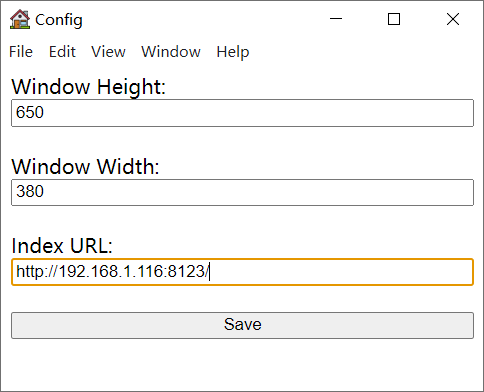
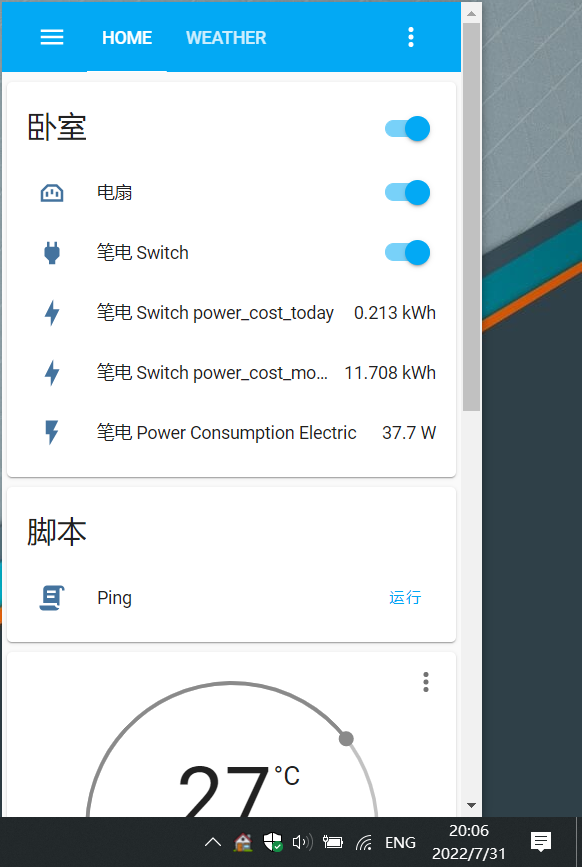
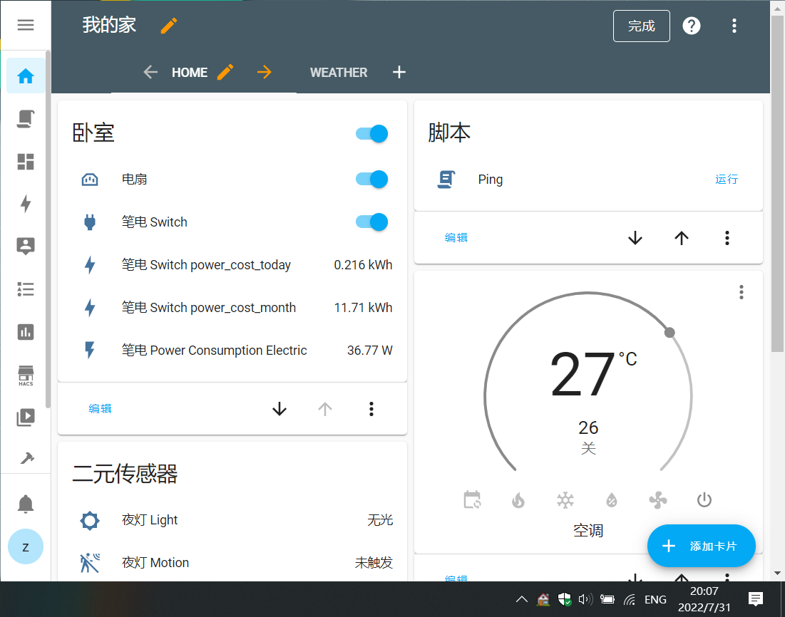

# Home Assistant Tray

## Screenshots

Right click to configure the app, set Index URL to the page you want to open, then restart the app.

Default window size.

Set width to 880.

## Acknowledgements

Icon was made by Freepik from [flaticon](https://www.flaticon.com/free-icon/house_619153).
